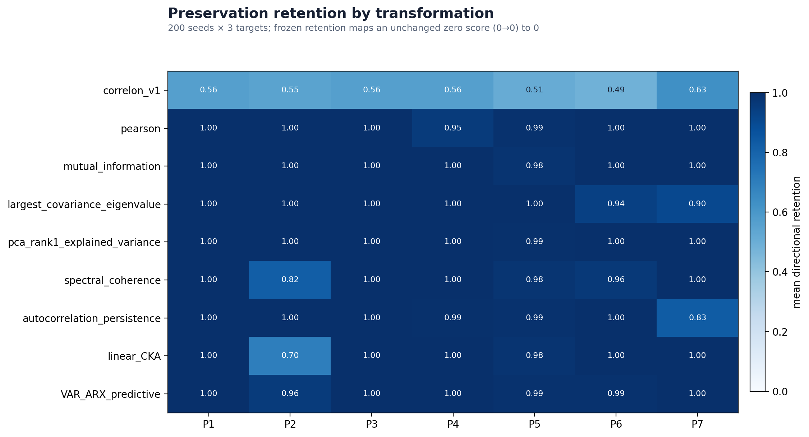
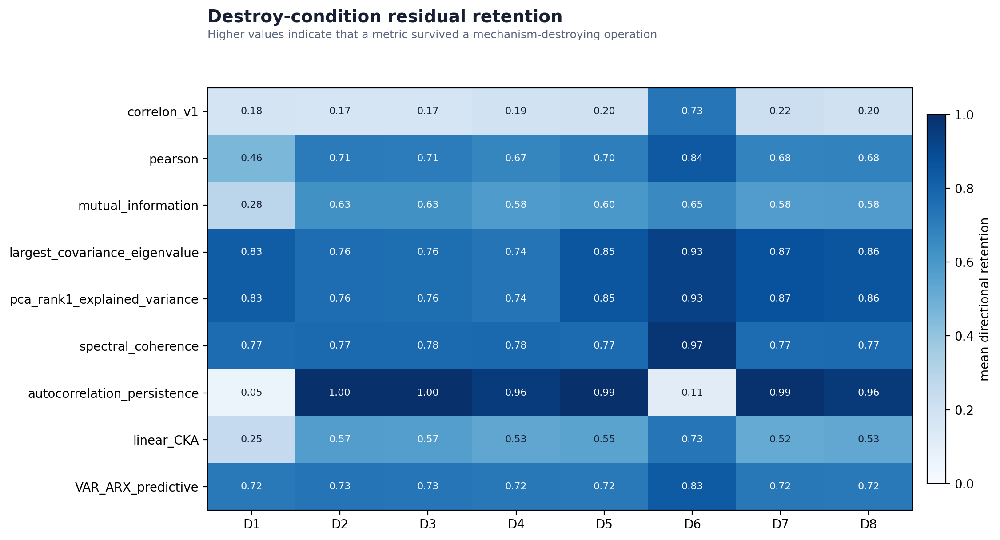
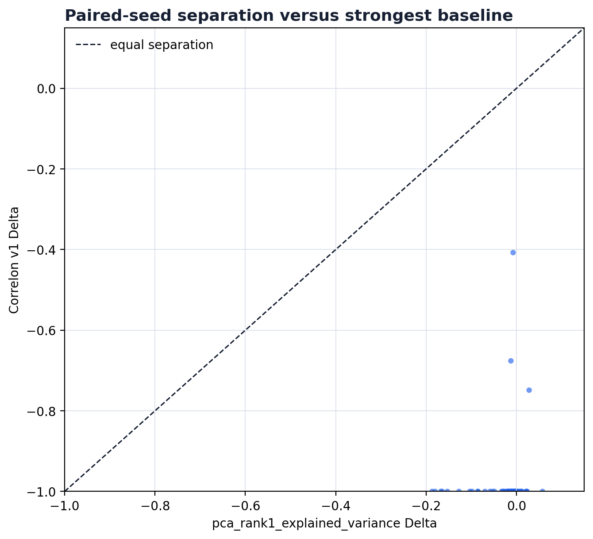
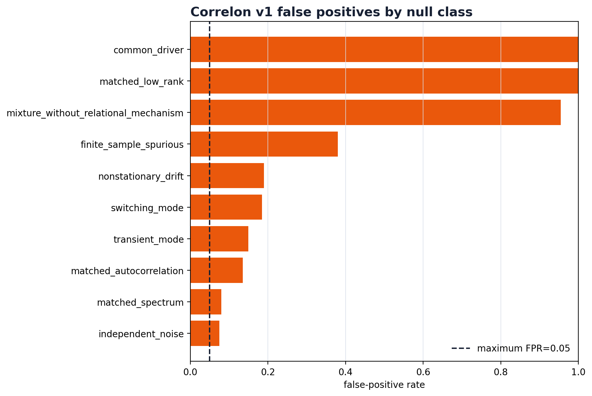
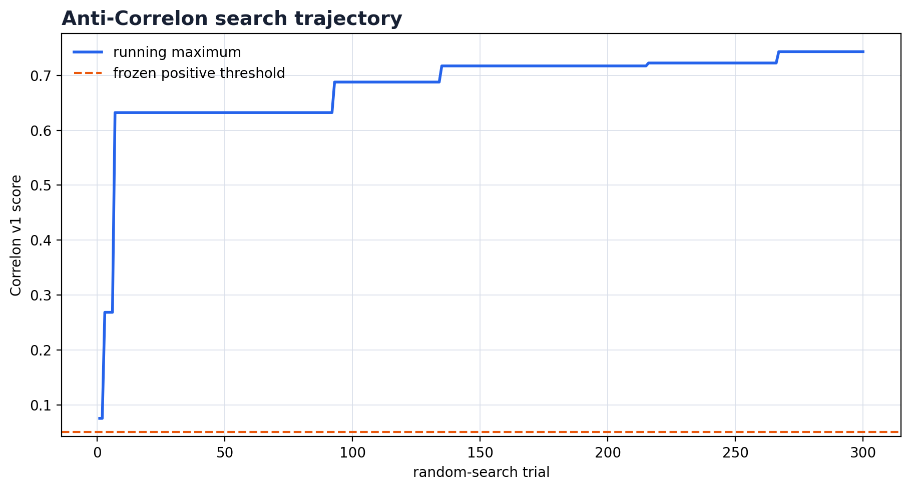
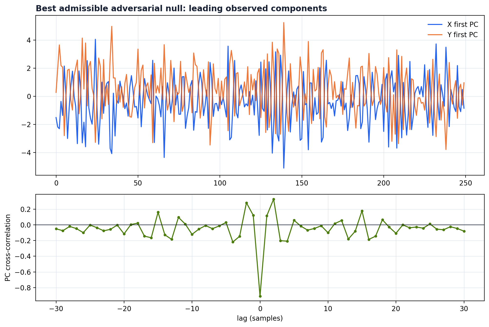
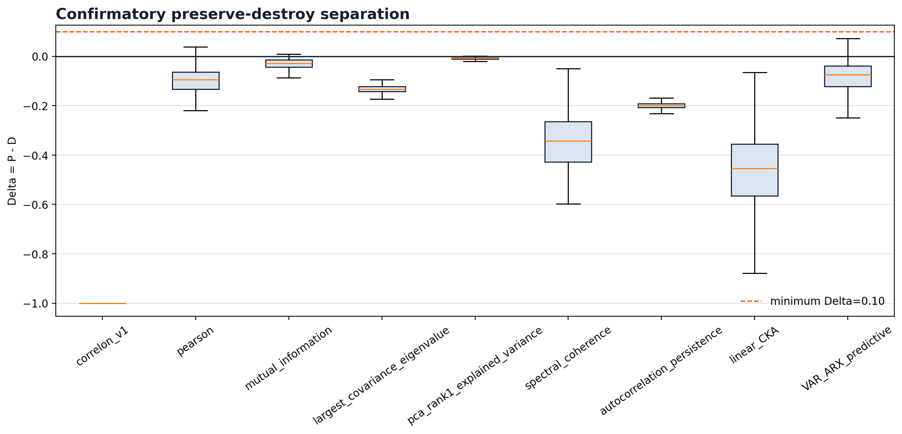
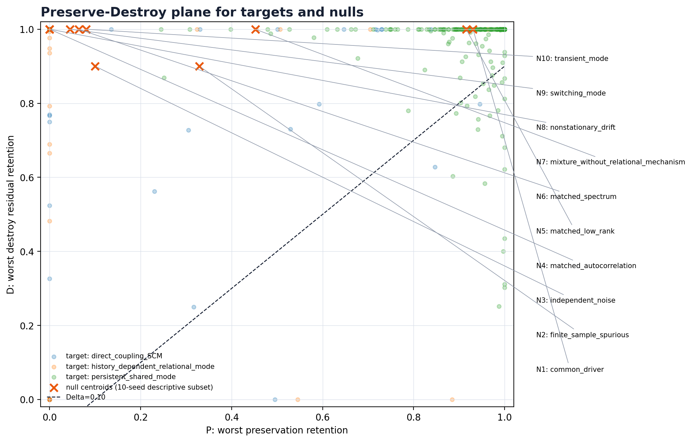

# Correlon Zero — Adversarial Invariance Falsification Results

## 1. Executive verdict

**FALSIFIED_REPRESENTATION_DEPENDENCE**

The frozen v1 observable was tested without post-confirmatory repair. Its mean preserve-destroy separation was `-0.9942` with 95% bootstrap CI `[-1.0000, -0.9863]`; the 5th percentile was `-1.0000`. The strongest named false-positive class was `common_driver` with FPR `1.000` against the frozen positive threshold.

The primary label follows the preregistered decision precedence, but its wording needs a material caveat: the maximum P1/P4 absolute score change was `9.600e-15` across all 600 target-world cases, below the `1e-12` numerical-equivalence tolerance. The formal P1/P4 failure rate arose because `262` / `600` untransformed target scores were at zero and the frozen ratio maps `0→0` to retention `0`. The empirical defect is therefore a target-score floor/sensitivity failure, not observed permutation or basis dependence.

This verdict concerns only the frozen operational definition in the tested synthetic domain. It makes no ontological or direct-causal claim.

## 2. Frozen hypothesis

The candidate had to remain stable under P1-P7, disappear under D1-D8, keep its lower-tail `Delta=P-D` positive, hold every negative-class FPR at or below `0.05`, and exceed the per-seed strongest baseline by `0.10`.

| generator class | role | frozen mechanism |
|---|---|---|
| persistent_shared_mode | target | fixed bidirectional rank-1 cross-lag, coefficient 0.28 |
| direct_coupling_SCM | target | fixed nonlinear X→Y edge at delay 2, coefficient 0.65 |
| history_dependent_relational_mode | target | fixed X-history→Y edge with memory coefficient 0.92 |
| independent_noise | negative | independent AR(1) spaces |
| common_driver | negative | latent AR(1) common cause; no X↔Y edge |
| matched_low_rank | negative | iid rank-1 common factor; no directed edge |
| matched_spectrum | negative | independently phase-randomized target spectra |
| matched_autocorrelation | negative | independently simulated per-space VAR(1) models |
| switching_mode | negative | coupling orientation switches halfway; no full-record identity |
| transient_mode | negative | coupling active only in middle third |
| nonstationary_drift | negative | shared deterministic drift plus independent residuals |
| finite_sample_spurious | negative | maximum v1 score among 8 independent AR(0.97) draws |
| mixture_without_relational_mechanism | negative | three changing common-factor blocks; no directed edge |

## 3. Operational Correlon definition

The frozen operator was the Phase-4 whitened cross-covariance SVD. The only primary scalar was:

```text
CorrelonZero_v1 = sqrt(clip(T_iso,0,1) * clip(T_floor,0,1))
```

`T_iso` is the dominant singular-gap excess over six circular-shift nulls. `T_floor` is the 10th-percentile adjacent-mode continuity excess over the same null family. The source specification is commit `8544101`; the pre-confirmatory scientific implementation hash is `efb4511ff21476614d01ec9449f24b4f3d92deabdd35995ae997cf376503b16c`. The postprocessing/report hash after the disclosed non-semantic amendments is `3449b49161ccf867b39540cf9f6146dfe46f64c59ce238f582427b250a4872cf`.

| field | frozen specification |
|---|---|
| operator | windowed whitened cross-covariance SVD Q=Cxx^(-1/2) Cxy Cyy^(-1/2) |
| preprocessing | per-window centering; channel-normalized synthetic worlds; no target-specific tuning |
| windowing | window=140; step=40; max_lag=3; epsilon=1e-5 |
| matched null | 6 deterministic circular shifts of Y sampled in [T/4, 3T/4) |
| components | T_iso=gap excess; T_floor=10th-percentile continuity excess |
| primary scalar | sqrt(clip(T_iso,0,1) * clip(T_floor,0,1)) |
| retention | clip(transformed / max(original,1e-12),0,1) |
| seed aggregation | P=min over targets and P1-P7; D=max over targets and D1-D8; Delta=P-D |
| positive threshold | 0.05106168 |
| scientific freeze | commit cb07d84; SHA-256 efb4511ff21476614d01ec9449f24b4f3d92deabdd35995ae997cf376503b16c |

## 4. Preserve transformation results

The weakest average preservation condition was `P6_time_reparameterization` with mean retention `0.4854`. Formal P1 and P4 representation-failure rates were `{'P1_node_permutation': 0.43666666666666665, 'P4_orthogonal_basis_rotation': 0.43666666666666665}`. These are ratio-rule failures: both transformations reproduced the absolute v1 score within `1e-12` in every target-world case; all failures were numerically unchanged zero scores. This preserves the frozen decision while preventing a false empirical claim of coordinate dependence.

| transformation | mean retention | frozen set |
|---|---|---|
| P6_time_reparameterization | 0.4854 | PRESERVE (frozen) |
| P5_observation_noise | 0.5111 | PRESERVE (frozen) |
| P2_global_scaling | 0.5507 | PRESERVE (frozen) |
| P4_orthogonal_basis_rotation | 0.5633 | PRESERVE (frozen) |
| P1_node_permutation | 0.5633 | PRESERVE (frozen) |
| P3_affine_offset | 0.5633 | PRESERVE (frozen) |
| P7_coarse_graining | 0.6325 | PRESERVE (frozen) |



## 5. Destroy transformation results

The largest residual retention was under `D6_common_driver_replacement` at `0.7321`. High D means the score remained after the preregistered mechanism-destroying operation.

| transformation | mean residual retention | frozen set |
|---|---|---|
| D6_common_driver_replacement | 0.7321 | DESTROY (frozen) |
| D7_history_destruction | 0.2162 | DESTROY (frozen) |
| D8_block_shuffle | 0.1984 | DESTROY (frozen) |
| D5_source_swap | 0.1963 | DESTROY (frozen) |
| D4_edge_cutting | 0.1933 | DESTROY (frozen) |
| D1_temporal_shuffle | 0.1781 | DESTROY (frozen) |
| D3_IAAFT_surrogate | 0.1674 | DESTROY (frozen) |
| D2_phase_randomization | 0.1672 | DESTROY (frozen) |



## 6. Conventional baseline comparison

The strongest baseline by mean Delta was `pca_rank1_explained_variance` at `-0.0150`. The conservative paired advantage of Correlon over the per-seed maximum baseline was `-0.9969` with CI `[-1.0039, -0.9879]`.

| metric | mean Delta | Correlon minus baseline |
|---|---|---|
| pca_rank1_explained_variance | -0.0150 | -0.9791 |
| mutual_information | -0.0237 | -0.9705 |
| VAR_ARX_predictive | -0.0818 | -0.9124 |
| pearson | -0.1001 | -0.8941 |
| largest_covariance_eigenvalue | -0.1343 | -0.8599 |
| autocorrelation_persistence | -0.2002 | -0.7940 |
| spectral_coherence | -0.3397 | -0.6544 |
| linear_CKA | -0.4543 | -0.5399 |



The whitened cross-covariance construction remains CCA-equivalent for the audited operator; CCA identity is therefore an interpretation constraint, not an omitted novelty claim.

## 7. Common-driver falsification

The common-driver false-positive rate was `1.000`. The common-driver class contains no direct X/Y edge by construction. Crossing the positive boundary therefore cannot be interpreted as evidence of direct causation.

## 8. Matched-null falsification

| negative class | FPR | crossings | n | maximum score |
|---|---|---|---|---|
| common_driver | 1.000 | 200 | 200 | 0.6148 |
| matched_low_rank | 1.000 | 200 | 200 | 0.6779 |
| mixture_without_relational_mechanism | 0.955 | 191 | 200 | 0.4791 |
| finite_sample_spurious | 0.380 | 76 | 200 | 0.1207 |
| nonstationary_drift | 0.190 | 38 | 200 | 0.1498 |
| switching_mode | 0.185 | 37 | 200 | 0.2069 |
| transient_mode | 0.150 | 30 | 200 | 0.1825 |
| matched_autocorrelation | 0.135 | 27 | 200 | 0.1223 |
| matched_spectrum | 0.080 | 16 | 200 | 0.1604 |
| independent_noise | 0.075 | 15 | 200 | 0.1492 |



## 9. Anti-Correlon adversarial search

The deterministic 300-trial search found maximum null score `0.7431`. `82` candidates crossed the frozen threshold `0.0511`, for crossing rate `0.273`. Every candidate had `direct_XY_edge=false` by construction.





## 10. Lower-tail and seed robustness

| metric | mean P | mean D | mean Delta | Delta CI95 | Delta q05 | Delta<=0 |
|---|---|---|---|---|---|---|
| VAR_ARX_predictive | 0.8988 | 0.9806 | -0.0818 | [-0.0911, -0.0726] | -0.2057 | 184 |
| autocorrelation_persistence | 0.7998 | 1.0000 | -0.2002 | [-0.2020, -0.1984] | -0.2237 | 200 |
| correlon_v1 | 0.0058 | 1.0000 | -0.9942 | [-1.0000, -0.9863] | -1.0000 | 200 |
| largest_covariance_eigenvalue | 0.8638 | 0.9981 | -0.1343 | [-0.1373, -0.1315] | -0.1615 | 200 |
| linear_CKA | 0.5323 | 0.9865 | -0.4543 | [-0.4757, -0.4324] | -0.6823 | 200 |
| mutual_information | 0.9665 | 0.9901 | -0.0237 | [-0.0288, -0.0182] | -0.0700 | 181 |
| pca_rank1_explained_variance | 0.9831 | 0.9981 | -0.0150 | [-0.0195, -0.0110] | -0.0705 | 186 |
| pearson | 0.8922 | 0.9923 | -0.1001 | [-0.1084, -0.0919] | -0.2087 | 193 |
| spectral_coherence | 0.6598 | 0.9995 | -0.3397 | [-0.3558, -0.3239] | -0.5187 | 200 |



The confirmatory unit was the seed after worst-case aggregation across all three target classes. No favorable seed selection or post-hoc transform removal was used.

Execution integrity: `10/10` transformation tests passed. Independent validation passed all row-count, seed-aggregation, FPR, point-estimate, baseline-selection, paired-advantage, adversarial-recomputation, implementation-hash, finite-value, and image checks. The validated tables contain 81,000 transform rows, 5,400 target-world rows, 18,000 negative-score rows, 1,800 seed-metric rows, and 300 adversarial cases.

## 11. Supported claims

- The report identifies how the frozen score behaved under every named transformation and null class.
- P1 node permutation and P4 orthogonal basis rotation preserved the absolute v1 score within `1e-12` in all 600 tested target-world cases.
- The frozen ratio rule is ill-posed at the score floor for invariance classification: it records unchanged `0→0` cases as retention zero.
- Any positive target score is descriptive; it does not imply direct causation.

## 12. Falsified claims

Primary label: **FALSIFIED_REPRESENTATION_DEPENDENCE**.

All recorded failure labels: `['FALSIFIED_REPRESENTATION_DEPENDENCE', 'FALSIFIED_COMMON_DRIVER', 'FALSIFIED_MATCHED_NULL', 'FALSIFIED_BY_BASELINE', 'FALSIFIED_ADVERSARIAL']`.

The experiment does not support interpreting strong correlation, persistence, low rank, common-driver dependence, or predictive dependence as uniquely Correlon-specific merely because v1 is positive.

## 13. Remaining ambiguity

The experiment is synthetic and bounded to the frozen generator families, sample sizes, transformations, and scalar readout. The formal primary label is a consequence of the preregistered precedence and zero-floor ratio; it is not evidence that P1 or P4 altered the score. Independent of that label, common-driver and matched-low-rank FPRs, baseline dominance, and 82 adversarial crossings each separately falsify necessary v1 criteria. A failure identifies an operational non-uniqueness or insensitivity; it does not prove that no future relational invariant can exist.

## 14. Final decision

**FALSIFIED_REPRESENTATION_DEPENDENCE** under the preregistered precedence, with the zero-floor caveat stated above. The Preserve-Destroy plane below shows target worlds and a clearly marked 10-seed descriptive null subset.



## 15. Exact next experiment

Preregister Correlon Zero v2 with two separate gates before using any preserve/destroy ratio: (1) a target-sensitivity gate that rejects a candidate when its untransformed target score is at the floor, and (2) an explicit zero-to-zero equivalence rule for invariance. Then use fresh target seeds and hold out the present common-driver, matched-low-rank, and adversarial-null parameter regions until final evaluation. The present v1 remains rejected and these seeds may not be used to tune v2.
