# Timeless Correlator T4-T7 - Falsification Report

## 1. Executive verdict

The program does not support a Correlon-specific derivation of time. Equal-time
correlators do not identify flow; directed relations recover ordinary causal order;
stable semigroup families can carry a relative coordinate but periodic aliases destroy
universal duration uniqueness; and orientation is unavailable until signed asymmetric
information is supplied. The overall verdict is **STANDARD_THEORY_SUFFICIENT**.

## 2. Repository and continuity audit

- Repository: `osskosc-lab/correlon`
- Source branch: `agent/timeless-correlon-phase-t0-t3`
- Source HEAD: `a727f11e95e40d7b0919dc87dd9730bfc16abc69`
- Working branch: `agent/timeless-correlator-order-duration-arrow-t4-t7`
- Frozen configuration SHA-256: `1abf591ad8b5a61c5645bf397ee240717a7302b03bfdbf33051c6e0451f1c7e6`

All T0-T3 files and verdicts were inherited without modification. The supplied Phase R
result `EXISTING_THEORY_SUFFICIENT` was treated as contextual continuity, not as input
data for T4-T7.

## 3. Frozen inherited T0-T3 conclusions

T0 remains `C_ONLY_TIME_NO_GO`; T1 remains restricted recovery with external canonical
structure; T2 remains a modular-flow theorem control; and T3 remains
`CORRELON_EQUALS_CCA_FOR_THIS_OPERATOR`.

## 4. Information-budget design

B0 contains only equal-time statistics; B1 adds directed response relations; B2 provides
an unlabeled operator family; B3 adds an explicit asymmetric-current channel. Ground
truth was isolated from estimator records and used only for scoring.

## 5. T4 full equal-time correlator no-go

Verdict: **FULL_EQUAL_TIME_NO_GO**. The paired OU systems share exactly `N(0,I)`, so
their full equal-time hierarchy is identical, while their generator and probability
current differ. Sample moments through order six were finite-sample diagnostics only.

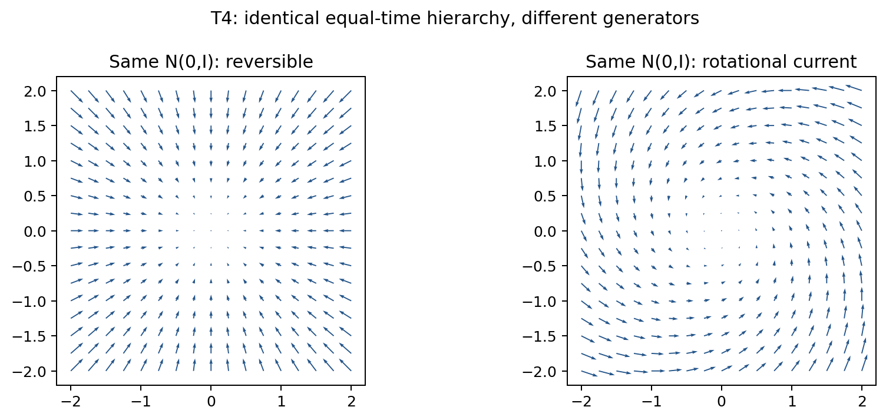

## 6. T5 order-identifiability results

Verdict: **CAUSAL_ORDER_ONLY**. Median reachability F1 was
`1.000000`; cycle-detection accuracy was
`1.000000` and false-total-order rate was
`0.000000`. The estimator was identical to standard
causal reachability at the same information budget.

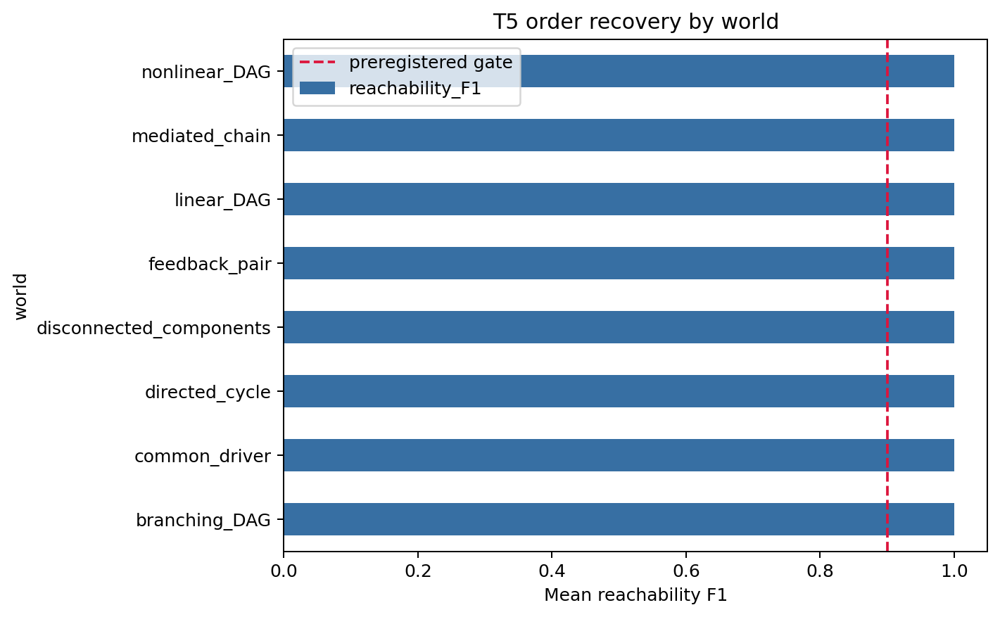

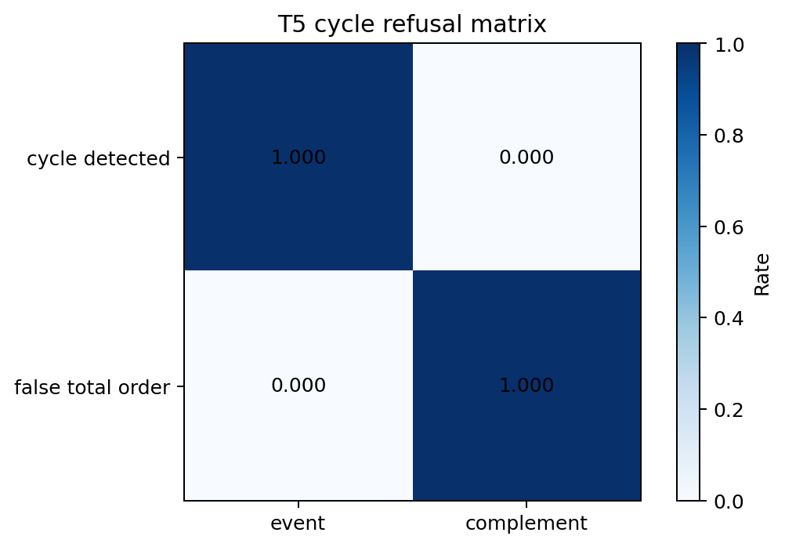

## 7. T6 duration-identifiability results

Primary verdict: **DURATION_ALIASING**. On stable identifiable worlds, median
positive-affine error was `1.20093e-15`
and median rank accuracy was `1.000000`.
Nevertheless, exact periodic aliases established non-uniqueness; matrix-log branches
were ambiguous, and multi-clock worlds rejected a single scalar coordinate. Matrix-log
performance tied the proposed estimator.

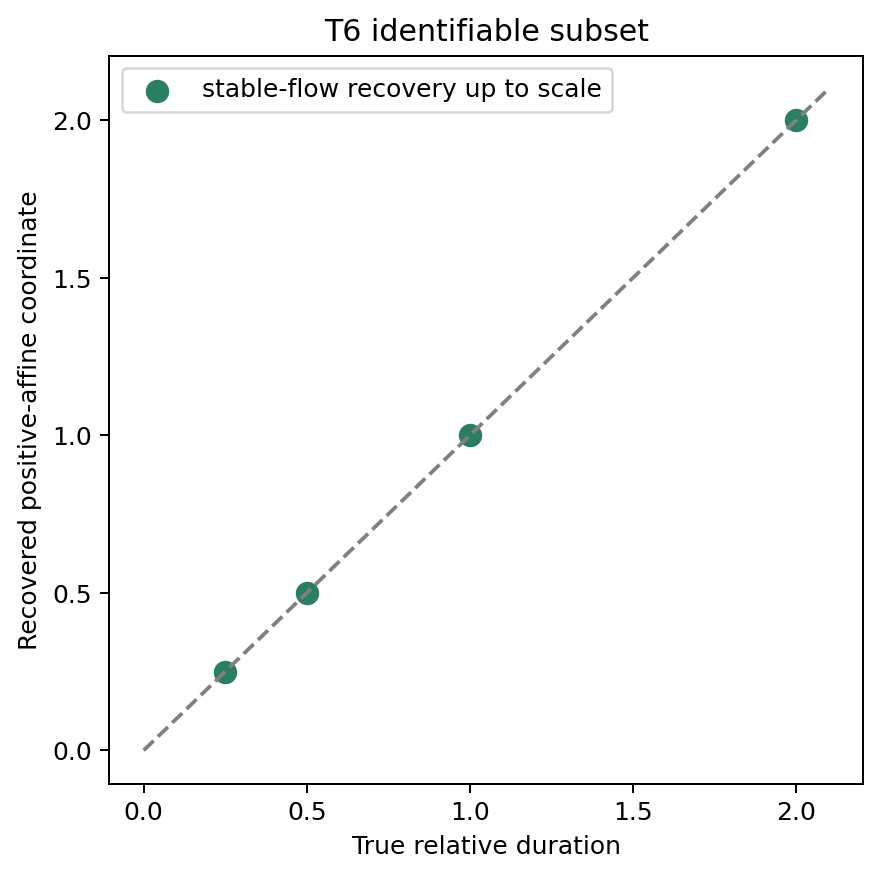

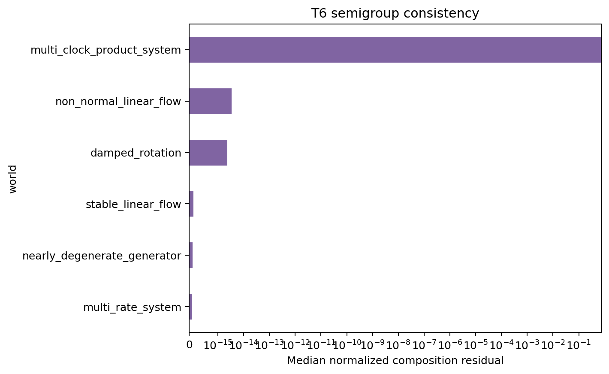

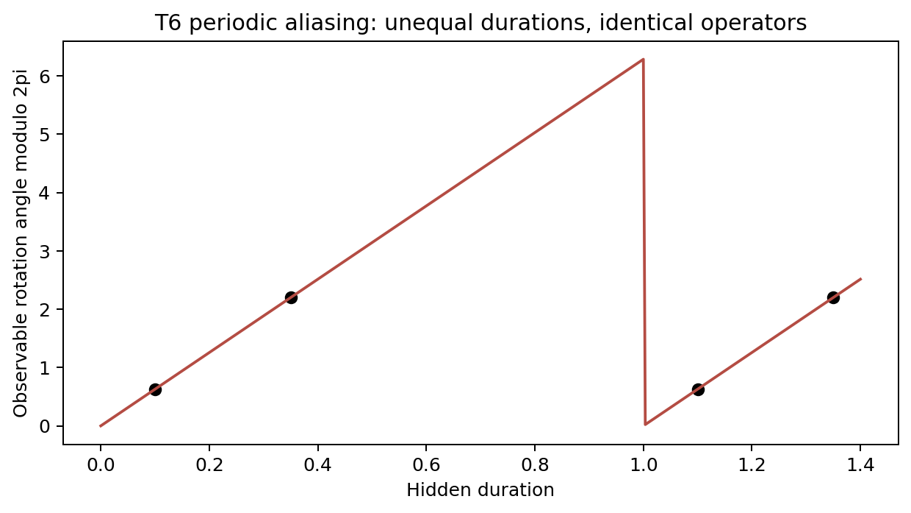

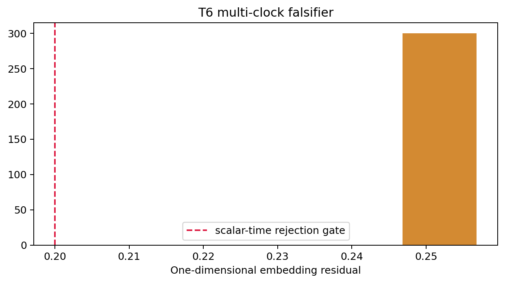

## 8. T7 arrow-identifiability results

Verdict: **ARROW_REQUIRES_ASYMMETRY**. Symmetric-input mean AUC was
`0.500000`; signed-current mean AUC was
`1.000000`. Unsigned entropy production was itself
unchanged under reversal in the paired construction. Orientation therefore depended on
an explicitly supplied signed asymmetric primitive.

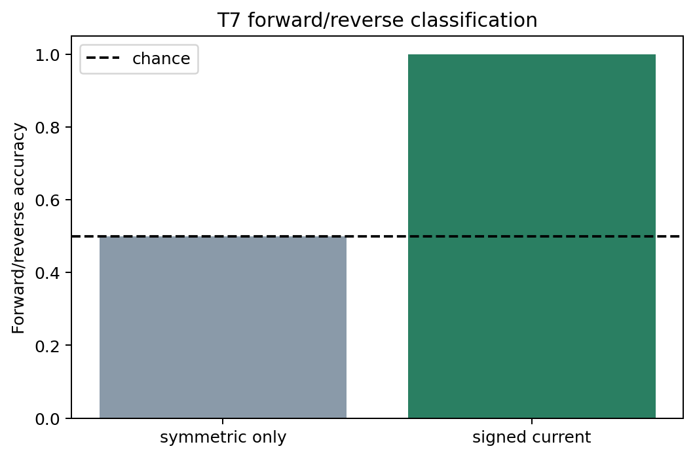

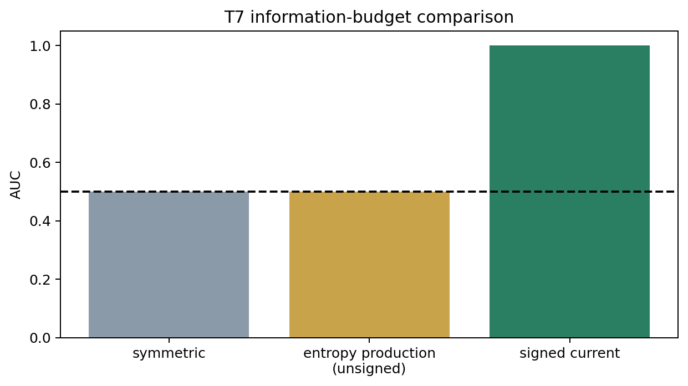

## 9. Clock-leakage audit

Status: **PASS**. Timestamps, sample indices, duration labels, true node
orders, and filename orientation labels were absent. Metadata-only adversaries remained
inside the preregistered chance interval, and permutation invariance was exact.

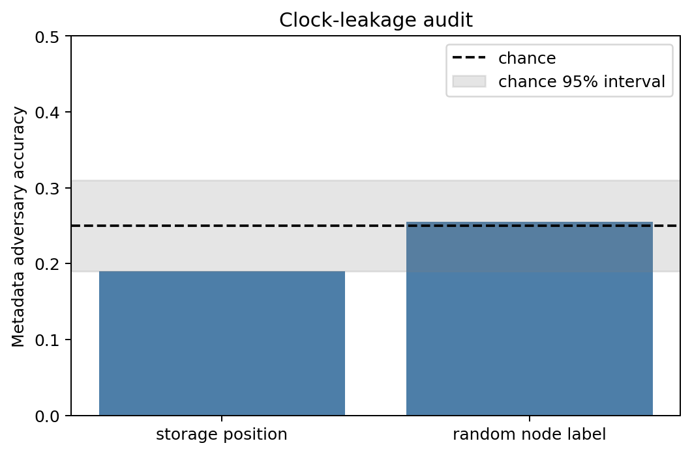

## 10. Standard-baseline comparison

The strongest same-budget baselines were causal reachability, matrix logarithms, and
probability current. Each tied the corresponding proposed reconstruction. The Phase R
context independently reported the same pattern for ARX/FIR dynamics.

## 11. Adversarial worlds

Same-distribution/different-flow pairs broke state-to-flow uniqueness; cycles refused a
global total order; periodic rotations produced duration aliases; multi-clock products
rejected one-dimensional scalar time; and forward/reverse twins matched on every
symmetric feature.

## 12. Final untouched holdout

Status: **PASS**. H1-H7 were opened only after confirmation was frozen,
and no threshold, metric, or model was changed afterward.

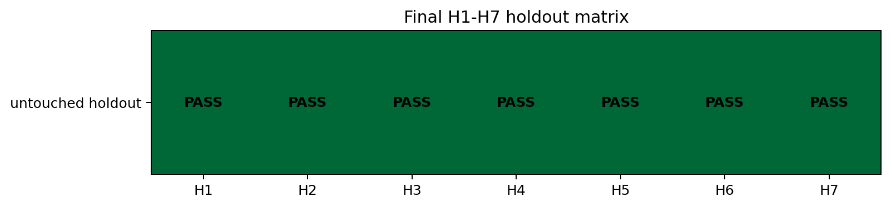

## 13. Supported claims

1. Full equal-time stationary correlators do not uniquely identify dynamics.
2. Directed intervention relations can identify ordinary causal partial order.
3. Restricted stable semigroups can encode a relative coordinate up to gauge.
4. Signed probability current can orient a forward/reverse pair.

## 14. Falsified claims

1. Higher equal-time correlators rescue a universal state-to-flow map.
2. Unlabeled transition families universally determine duration.
3. Symmetric relations determine a preferred orientation.
4. Every relation network admits a single scalar time coordinate.

## 15. Claims not established

Physical time, proper time, causality emergence, spacetime emergence, and any
Correlon-specific advantage are not established.

## 16. Final decision labels

- T4: `FULL_EQUAL_TIME_NO_GO`
- T5: `CAUSAL_ORDER_ONLY`
- T6: `DURATION_ALIASING`; secondary `GENERATOR_AMBIGUITY`, `SCALAR_TIME_MODEL_REJECTED`
- T7: `ARROW_REQUIRES_ASYMMETRY`
- Overall: `STANDARD_THEORY_SUFFICIENT`
- `RELATIONAL_TIME_CANDIDATE`: false

## 17. Exact next experiment

Preregister a non-Markov T8 only as a separate standard-theory sufficiency test: compare
fractional, generalized-Langevin, and hidden-state models under the same history budget.
Do not use T8 to rescue any failed T4-T7 bridge.
