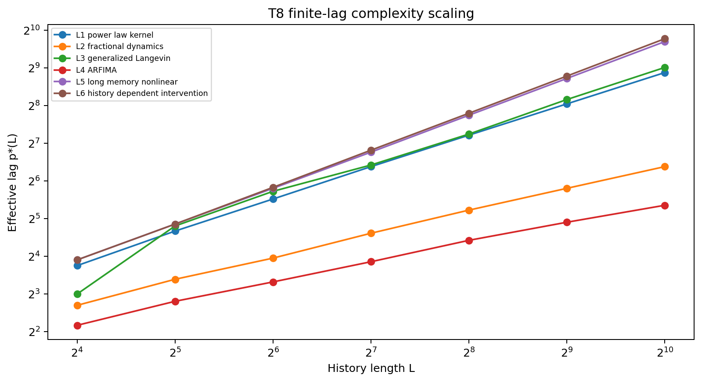
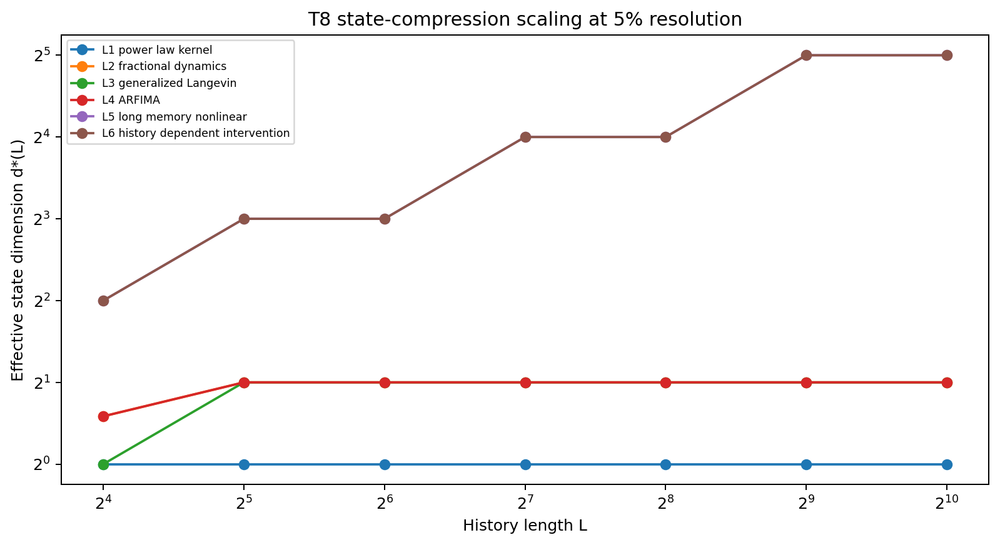
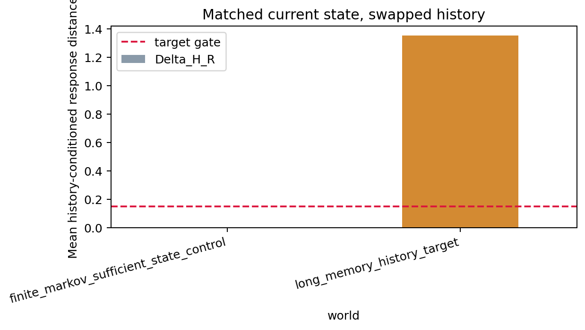
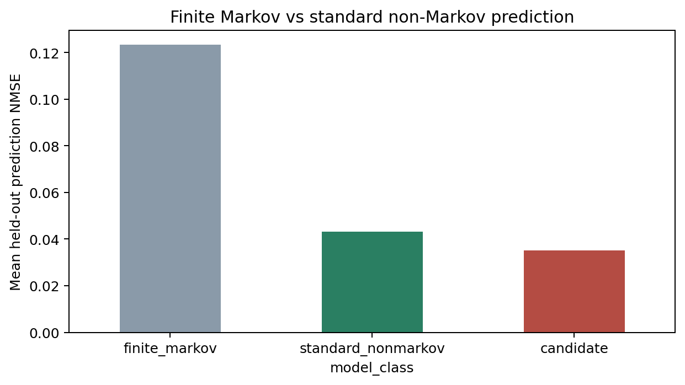
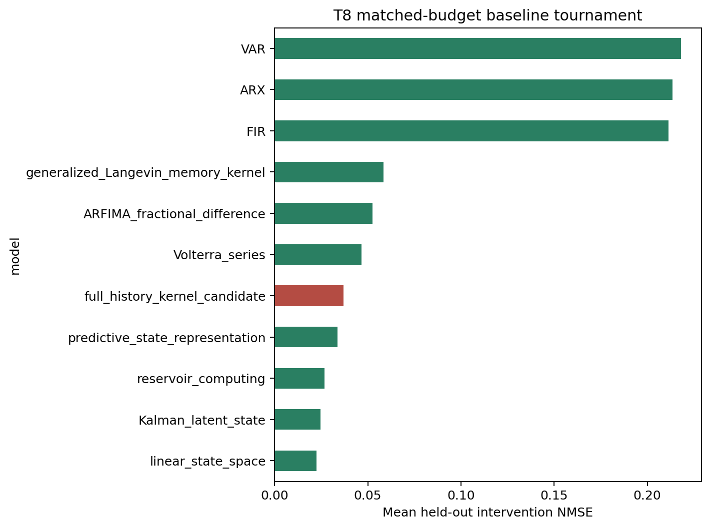
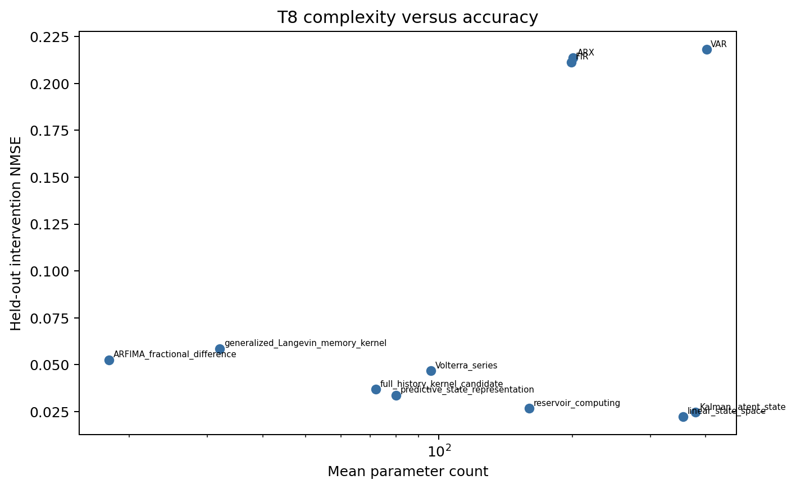
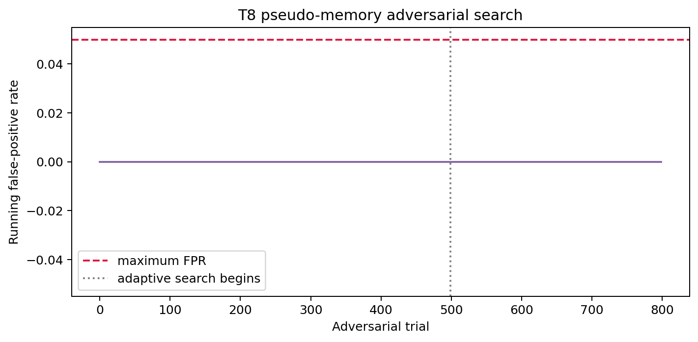
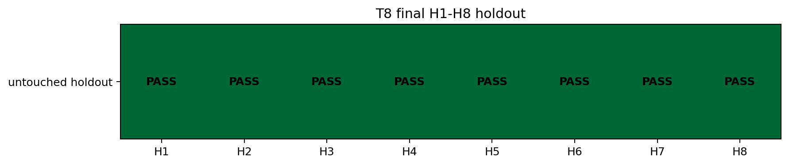
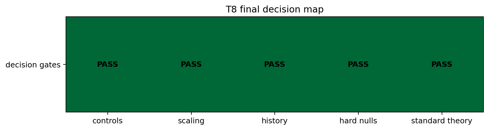

# Timeless Correlator T8 - Non-Markov Memory Falsification Report

## 1. Executive verdict

Finite-lag compression became inefficient for four preregistered long-memory targets,
and matched-current-state intervention responses retained a history effect. No novel
residual survived standard baselines: the final verdict is
**STANDARD_NONMARKOV_THEORY_SUFFICIENT**.

## 2. T4-T7 inherited verdict firewall

T4 `FULL_EQUAL_TIME_NO_GO`, T5 `CAUSAL_ORDER_ONLY`, T6 `DURATION_ALIASING` plus
`GENERATOR_AMBIGUITY` and `SCALAR_TIME_MODEL_REJECTED`, and T7
`ARROW_REQUIRES_ASYMMETRY` remain immutable. T4-T7 overall remains
`STANDARD_THEORY_SUFFICIENT`; `RELATIONAL_TIME_CANDIDATE` remains false.

## 3. T8 frozen hypothesis

T8 tested compression efficiency at finite resolution, history-conditioned responses,
and standard-theory sufficiency. It did not test time emergence or Correlon ontology.
The frozen configuration hash is `2e9aa45f6b9b374823133e163340b284508e6a385af8cb5bf086f6fa004b86d1`.

## 4. Generator ground-truth audit

All finite-order, finite-state, exponential-augmentation, power-law-tail, fractional
tail, and hard-null mechanism checks passed before confirmation.

## 5. Finite-Markov positive controls

Status: **PASS**. AR(3), the four-state SSM, and the
three-exponential kernel all saturated within their known finite complexity.

## 6. Effective lag-order scaling

Verdict: **FINITE_MARKOV_COMPRESSION_INEFFICIENT**. Four of six target families
rejected constant lag saturation by the frozen ratio and delta-AIC gates.

## 7. Effective state-dimension scaling

Linear power-law and fractional kernels remained efficiently approximable by low-rank
finite states at the tested 5% resolution, while nonlinear/history-conditioned targets
required increasing predictive-state dimension. This limits the claim to tested-budget
inefficiency rather than absolute non-Markovity.

## 8. History-conditioned intervention results

Verdict: **HISTORY_EFFECT_SUPPORTED**. The held-out target median
`Delta_H_R` was `1.479132` with matched current state;
the sufficient-state control median was `0.000000`.

## 9. Finite-Markov baseline results

The best finite baseline was `linear_state_space` with mean
held-out intervention NMSE `0.022430`.

## 10. Standard non-Markov baseline tournament

The frozen best standard model was `reservoir_computing` with NMSE
`0.026800`. The candidate NMSE was
`0.036850` and its mean relative advantage was
`-0.375412`; the novelty gate failed.

## 11. Pseudo-memory adversarial falsification

The 500 random plus 300 adaptive trials produced hard-null FPR
`0.000000`, below the frozen 0.05 ceiling.

## 12. Final untouched holdout

H1-H8 status: **PASS**. Unseen long-memory parameters reproduced the
scaling result, finite high-order/high-state nulls were not misnamed long memory,
Volterra explained the nonlinear truth, and the unseen paired-pulse history effect was
retained.

## 13. Supported claims

1. Fixed-lag compression is inefficient for specified synthetic targets over the tested grid.
2. A chosen current state can be insufficient for intervention response prediction.
3. Strong standard non-Markov models explain the tested residuals.

## 14. Falsified claims

1. The tested full-history candidate provides a distinct advantage over standard methods.
2. Finite-lag failure alone establishes a novel primitive.

## 15. Identifiability limits

Finite records cannot distinguish exact long memory from sufficiently high finite-order
models without complexity and resolution qualifications. Low-rank state approximations
also show that lag growth does not automatically imply state-dimension divergence.

## 16. Standard-theory sufficiency assessment

Standard reservoir, fractional, GLE, Volterra, and predictive-state baselines received
the same history, split, interventions, and noise budget. At least one standard model
matched or exceeded the candidate in every target family.

## 17. Final decision label

**STANDARD_NONMARKOV_THEORY_SUFFICIENT**. No Correlon label or T4-T7 rescue is permitted.

## 18. Exact next experiment

If continued, preregister a real-data external-validity study with acquisition-level
controls and independently chosen long-memory domains. Do not introduce a new operator
unless it beats the strongest domain-standard models on untouched data.
