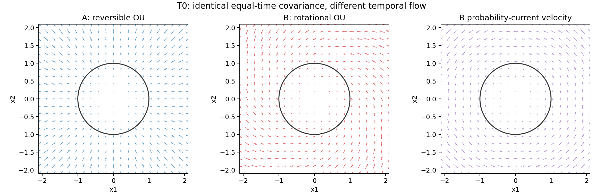
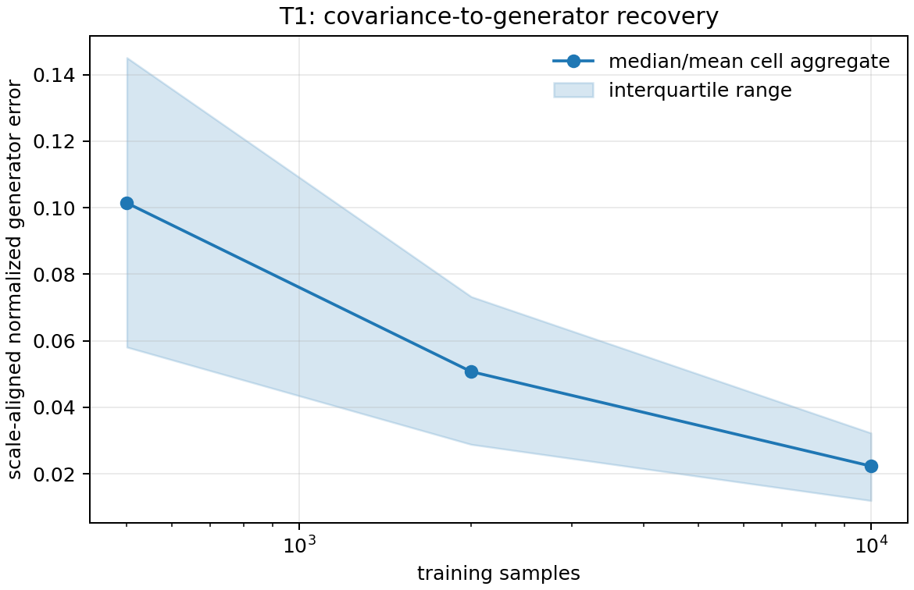
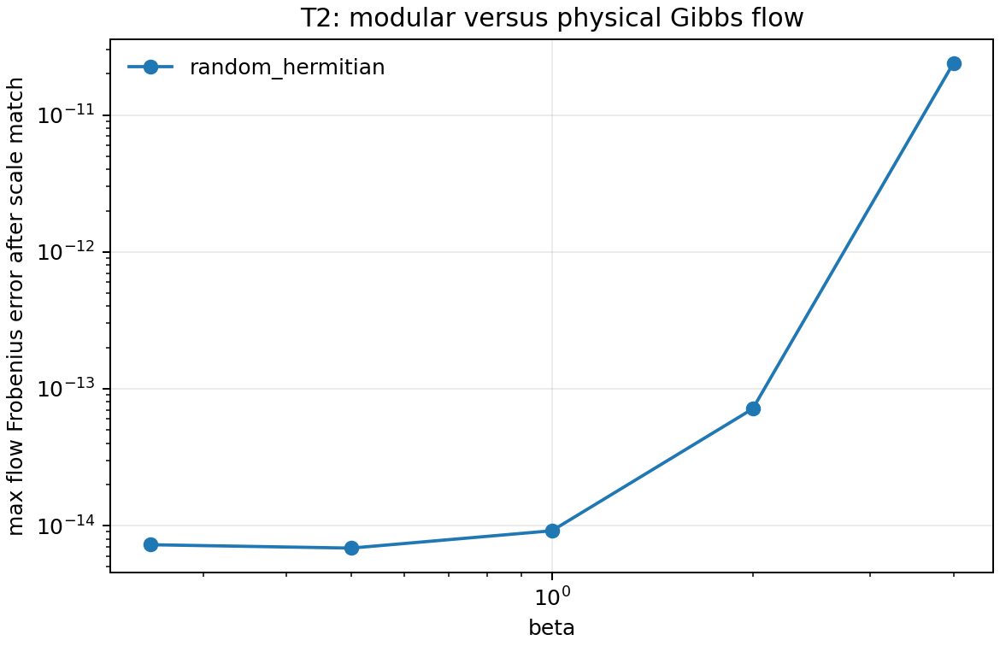
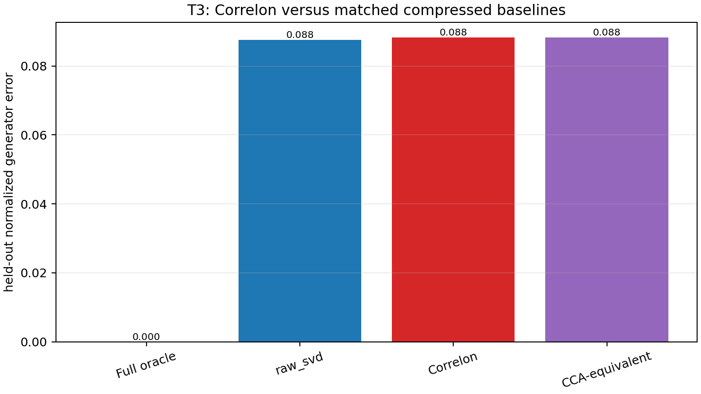

# Timeless Correlon — Falsification Report

## Executive Verdict

The universal claim that equal-time covariance alone determines physical time flow is **falsified** by the preregistered T0 same-`C`/different-dynamics counterexample.

The surviving result is conditional:

- In the restricted Gaussian-Gibbs regime, covariance reconstructs a Hamiltonian generator only when the canonical symplectic structure is supplied independently.
- T2 reproduces the known modular-flow/Gibbs-flow theorem within numerical tolerance; this is calibration, not new Correlon evidence.
- T3 does not establish a Correlon-specific relation-to-state bridge. The frozen Correlon operator is numerically identical to the corresponding CCA construction, and the confirmation specificity gate is not passed.

No Phase 5C verdict was reopened. No direct-causation, spacetime-emergence, or physical-time-emergence claim is retained.

## Frozen Hypotheses

| Hypothesis | Result |
|---|---|
| H_T0: `C` alone uniquely determines temporal dynamics | **Falsified — `C_ONLY_TIME_NO_GO`** |
| H_T1: known canonical Gibbs-Gaussian regime permits `C -> flow` up to scale | **Supported as restricted positive control** |
| H_T2: Gibbs state modular flow agrees with Hamiltonian flow up to beta scale | **Control pass; known theorem reproduced** |
| H_T3: compressed Correlon state bridge beats matched low-dimensional placebos | **No distinct support; CCA identity applies** |

## Repository and Reproducibility State

- Repository: `osskosc-lab/correlon`
- Source branch: `agent/phase5c-interventional-representation-falsification`
- Working branch: `agent/timeless-correlon-phase-t0-t3`
- Source base commit: `c470b02770571e9cb0e98836545b4edb0a011ba2`
- Report-generation context: `agent/timeless-correlon-phase-t0-t3 / c470b02770571e9cb0e98836545b4edb0a011ba2`
- Frozen T3 configuration SHA-256: `2fc6dbbdfc2b30b24d824bf6b5985d0c433b305e25f012c30a1cf2ac25c8abdc`
- Development seeds: `0..49`
- Validation seeds: `1000..1049`
- Confirmation seeds: `10000..10199`

Exact commands:

```bash
python experiments/Timeless_T0_sameC_no_go.py
python experiments/Timeless_T1_gaussian_gibbs.py
python experiments/Timeless_T2_modular_flow.py
python experiments/Timeless_T3_relation_state_bridge.py --stage development
python experiments/Timeless_T3_relation_state_bridge.py --stage validation
python experiments/Timeless_T3_relation_state_bridge.py --stage confirmation
python experiments/Timeless_validate.py
python experiments/Timeless_make_report.py
```

## T0 Same-C Different-Dynamics No-Go

The reversible system `A0=-gamma I` and the rotational system `A1=-gamma I+Omega J` both have stationary population covariance `Sigma=I`. For every `Omega>0`, the second system has a non-zero rotational probability current and a different generator.

| Quantity | Result | Gate |
|---|---:|---:|
| Generator difference 95% CI | `2.067269 .. 2.307731` | lower >= 0.20 |
| Current difference 95% CI | `0.726203 .. 0.752818` | lower >= 0.20 |
| Exact population covariance difference | `0.000000` | upper <= 0.05 |
| Formal verdict | **C_ONLY_TIME_NO_GO** | pass |

The finite-trajectory diagnostic is deliberately reported separately. With `gamma=0.25`, 5000 points at `dt=0.01` contain only a limited number of correlation times; the maximum pooled empirical covariance bootstrap upper bound was `0.194690`. This does not undo the exact population counterexample; it quantifies the finite-sample cost of estimating `C` from a short correlated trajectory.



**Interpretation:** a C-only universal time-flow map cannot be identifiable. The minimum primitive must include additional temporal/asymmetric information or additional algebraic structure.

## T1 Restricted Gibbs-Gaussian Recovery

The canonical structure `J` was supplied. With `C=(beta K)^(-1)`, the reconstruction used `K_hat=inverse(C_hat)` and `A_hat=J K_hat`, with one positive global scale optimized only for evaluation.

| Metric | Result | Threshold |
|---|---:|---:|
| Median generator error, `N>=2000`, condition <= 10 | `0.031135` | <= 0.10 |
| Median held-out vector-field cosine | `0.999496` | >= 0.95 |
| Error medians at N=500, 2000, 10000 | `{'10000': 0.0224083756793006, '2000': 0.0508172905315587, '500': 0.1021405133447192}` | monotone improvement |
| Positive-control verdict | **RESTRICTED_GIBBS_GAUSSIAN_RECOVERY** | pass |
| Unknown-J generator-error 95% CI | `0.836114 .. 0.873879` | lower >= 0.20 |



**Allowed claim:** covariance can encode a flow generator in this restricted Gibbs-Gaussian setting because the state class and canonical algebra are supplied. It is not a derivation from correlation alone.

## T2 Modular Flow Calibration

For faithful finite-dimensional Gibbs states, `K_mod=-log(rho)=beta H+cI`. The implementation compared modular and Hamiltonian flows over a frozen Hermitian observable basis.

| Metric | Result | Threshold |
|---|---:|---:|
| Maximum generator error | `2.852406e-12` | <= 1e-8 |
| Maximum flow Frobenius error | `2.395515e-11` | <= 1e-6 |
| Verdict | **MODULAR_FLOW_CONTROL_PASS** | pass |



This confirms the known state-to-modular-flow relation and beta rescaling. It does not show that Correlon generated the state, the algebra, the time orientation, entropy production, or geometric proper time.

## T3 Correlon Relation-to-State Bridge

The validation freeze selected Correlon rank `4` and the best non-oracle low-dimensional baseline `raw_svd` at rank `4`. The confirmation set contained `7200` paired cases.

| Quantity | Result |
|---|---:|
| Correlon mean generator error | `0.088297` |
| Best-baseline mean generator error | `0.087572` |
| Correlon relative gain | `-0.6859%` |
| Relative-gain 95% CI | `-0.7102% .. -0.6611%` |
| Specificity gate | **FAIL**; lower CI > 10% required |
| Correlon/CCA maximum difference | `0.000000e+00` |
| T3 verdict | **CORRELON_EQUALS_CCA_FOR_THIS_OPERATOR** |



The confirmation result does not provide a Correlon-specific bridge. Because the frozen normalized whitened cross-covariance construction is numerically identical to CCA for this operator, even an error advantage would not establish novelty over CCA.

## Placebo and Baseline Audit

- The best non-oracle baseline was selected on validation only and then frozen.
- Full covariance was treated as an oracle upper bound, not a legitimate compressed baseline.
- Block-diagonal, PCA rank-matched, random rank-matched, and raw truncated SVD were retained as explicit baselines.
- The Correlon/CCA identity check returned exactly zero in the recorded implementation.
- No baseline or rank was changed after the confirmation data were opened.

## Circularity Audit

The following protections were active:

1. T0 C-only reconstruction did not receive time labels, lags, derivatives, trajectory order, true drift, or current.
2. Supplied `J` was labelled external; it was not counted as emergent.
3. Positive scale fitting was used only to quotient out time-unit freedom.
4. T2 was labelled theorem reproduction, not discovery.
5. The Correlon operator was reused from Phase 4 and its CCA equivalence was tested.
6. Phase 5C's causal/interventional NO-GO remained unchanged.

## Supported Claims

1. Equal-time covariance does not uniquely identify temporal dynamics.
2. A Gaussian-Gibbs covariance can reconstruct a Hamiltonian flow only under supplied canonical/algebraic structure, up to an overall time scale.
3. Gibbs-state modular flow agrees numerically with Hamiltonian flow under the known beta rescaling.
4. The Phase-4-safe Correlon interpretation remains a descriptive, normalized persistent cross-space relation-mode detector.

## Falsified Claims

1. `C` alone universally generates physical time flow.
2. Covariance alone determines a unique flow when the symplectic/algebraic structure is unknown.
3. The present Correlon operator provides a demonstrated Correlon-specific relation-to-state advantage over matched low-dimensional baselines.
4. Any inference from Correlon-positive to direct causation.

## Unresolved Claims

1. A primitive relation structure can derive both the state `omega` and the observable algebra without external input.
2. A preferred time orientation or duration can be derived without importing temporal asymmetry.
3. Modular flow can be connected to geometric proper time or spacetime dynamics.
4. The bridge remains valid in generic non-Gibbs, non-Gaussian, non-equilibrium systems.

## Next Falsification Experiment

The next target should be an **algebra-free relation identifiability test**: construct pairs of systems with the same Phase-4 relation operator (and matched marginal spectra) but different admissible symplectic structures and different full-state generators. Feed only the frozen relation representation to the reconstruction, forbid `J`, lag, ordering, and hidden coordinates, and test whether the predicted generator is invariant or necessarily ambiguous. A failure would close the current state-to-flow rescue route; a pass would still support only a representation-specific result until the algebra and state are derived from the primitive itself.

## Output Files

- `TIMELESS_CORRELON_PREREGISTRATION.md`
- `experiments/Timeless_T0_sameC_no_go.py`
- `experiments/Timeless_T1_gaussian_gibbs.py`
- `experiments/Timeless_T2_modular_flow.py`
- `experiments/Timeless_T3_relation_state_bridge.py`
- `experiments/Timeless_validate.py`
- `results/timeless_T0_raw.csv`
- `results/timeless_T1_raw.csv`
- `results/timeless_T2_raw.csv`
- `results/timeless_T3_raw.csv`
- `results/timeless_correlon_config.json`
- `results/timeless_correlon_decision.json`
- `results/timeless_correlon_independent_validation.json`
